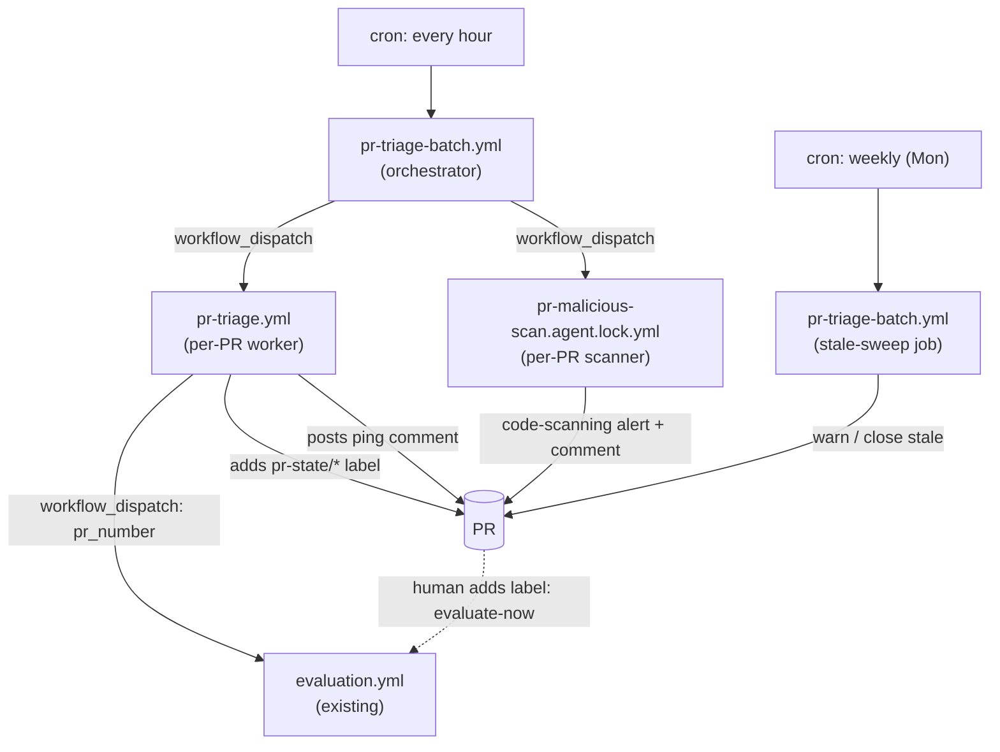

# PR Triage Workflows

Three GitHub Actions workflows keep open PRs moving without manual nudging:

- **`pr-triage-batch.yml`** — hourly orchestrator (cron `17 * * * *`). Enumerates
  open non-draft PRs, computes a deterministic state for each, and dispatches the
  per-PR worker (or the malicious-code scanner). No labels, no model calls; the
  only comment it posts is a one-time idempotency marker when it dispatches the
  malicious-code scanner. Also hosts the deterministic weekly **stale-PR sweep** (`stale-sweep`
  job, cron `17 4 * * 1`) — see [Stale-PR sweep](#stale-pr-sweep).
- **`pr-triage.yml`** — per-PR worker (`workflow_dispatch`). Re-validates the
  PR's state, reconciles a single `pr-state/*` label, and performs at most one
  of: trigger evaluation (by dispatching `evaluation.yml`), ping the author, or
  ping maintainers. Cool-down (default 4 days) is enforced via marker comments.
- **`pr-malicious-scan.agent.md`** — per-PR malicious-code scanner (gh-aw).
  Static diff review for untrusted contributors. Reports findings as
  code-scanning alerts and an optional comment; never executes PR head code.

## Architecture

## Entry points into `evaluation.yml`

Three entry points feed the `gate` job, all sharing a per-PR concurrency group
so a race collapses to a single run:

1. The existing **`/evaluate`** slash command (`issue_comment`) — humans.
2. The **`evaluate-now`** label (`pull_request_target [labeled]`) — humans. The
   `gate` job consumes (removes) the label so reapplying re-fires.
3. **`workflow_dispatch`** with a `pr_number` input — the triage worker. The
   worker runs as `github-actions[bot]`, and label events emitted by
   `GITHUB_TOKEN` do **not** start workflows (GitHub's recursion guard), so the
   bot cannot use entry point 2. `workflow_dispatch` is exempt from that guard,
   so the worker dispatches `evaluation.yml` directly. A dispatched run's
   `head_sha` is the default branch (not the PR head), so the worker matches the
   run by `evaluation.yml`'s run name (`Evaluate PR #<n> @ <sha7>`) for idempotency.

## State machine (worker)

Order of evaluation; first match wins:

| Order | Condition | State | Label | Action |
|---|---|---|---|---|
| 1 | draft, or `mergeable_state == unknown` | `skip` | — | none |
| 2 | non-bot && non-trusted && no malicious-scan marker on head | `needs-malicious-scan` | — | dispatch scanner |
| 3 | `CHANGES_REQUESTED` \|\| unresolved threads > 0 \|\| `mergeable_state == dirty` | `needs-author-attention` | `waiting-on-author` | author-ping |
| 4 | eval == success && `APPROVED` | `ready-for-merge` | `ready-to-merge` | maintainer-ping/C |
| 5 | eval == success && `REVIEW_REQUIRED`/none | `ready-for-review` | `waiting-on-review` | maintainer-ping/A |
| 6 | eval == success && other decision | `in-review` | `pr-state/in-review` | reconcile only |
| 7 | otherwise | `ready-for-eval` | `pr-state/ready-for-eval` | eval-trigger |

Trusted = `OWNER` / `MEMBER` / `COLLABORATOR`. Bots are short-circuited as trusted.

## Cool-down and idempotency

Each ping variant writes a hidden HTML marker into its comment. The worker
fetches prior bot comments and:

- If a marker for the same variant exists within `COOLDOWN_DAYS` (default 4),
  the new comment is suppressed.
- A first-ping age gate (default 30 min after PR creation) prevents pings on
  freshly opened PRs; it is bypassed once any prior ping marker exists.

Marker shapes:

- `<!-- pr-triage:fingerprint=author-ping:{sha7}:{yyyy-mm-dd} -->`
- `<!-- pr-triage:fingerprint=maintainer-ping/{A,B,C}:{sha7}:{yyyy-mm-dd} -->`
- `<!-- pr-malicious-scan:fingerprint={sha7}:{yyyy-mm-dd} -->`

## Labels owned by these workflows

State labels (exactly one is reconciled at a time). Where the existing label
taxonomy already covered a state, the workflow reuses it rather than introducing
a duplicate `pr-state/*` name:

- `pr-state/ready-for-eval` *(new)*
- `waiting-on-review` *(existing — reused for `ready-for-review`)*
- `ready-to-merge` *(existing — reused for `ready-for-merge`)*
- `waiting-on-author` *(existing — reused for `needs-author-attention`)*
- `pr-state/in-review` *(new)*

Triggers and opt-outs:

- `evaluate-now` — applied to fire evaluation; removed by the gate after consumption.
- `no-stale` — opt-out of stale-PR closure (honored by the `stale-sweep` job) and
  of author/maintainer pings in the worker.

## Stale-PR sweep

`pr-triage-batch.yml` includes a deterministic `stale-sweep` job that replaces the
former agentic `close-stale-prs.agent.md`. It runs weekly (cron `17 4 * * 1`) and
on manual `workflow_dispatch` with `stale_sweep=true`, and executes
[`.github/scripts/pr-stale-sweep.sh`](../../.github/scripts/pr-stale-sweep.sh) — no
model calls, no tokens.

Policy (unchanged from the agentic version):

- Considers every **open** PR, **including drafts**.
- "Last activity" is the most recent **non-bot** comment or review; if there is
  none, it falls back to the PR's `created_at`. `updated_at` and all `[bot]`
  activity are ignored so the bot's own warning never resets the timer.
- created ≤ 30 days ago → skip (too new).
- 30 days < inactivity ≤ 37 days → post a stale **warning** (once; guarded by a
  `<!-- pr-triage:stale-warning -->` marker).
- inactivity > 37 days → **close** the PR with a closing comment.
- Exempt: the `no-stale` label; authors `dotnet-maestro[bot]` / `dotnet-maestro`.

Inputs (via `workflow_dispatch`): `stale_sweep` (run the sweep), `dry_run` (log
decisions without writing), `stale_max` (hard cap on warn+close writes, default 25).
